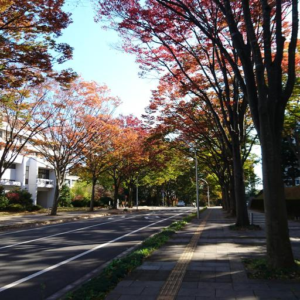
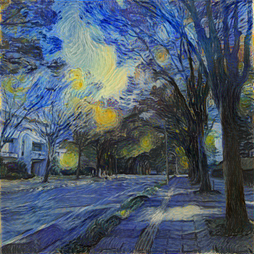
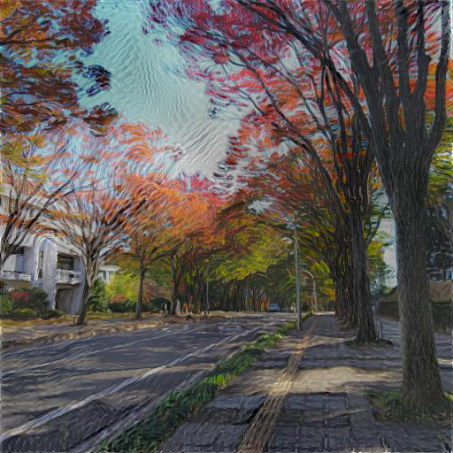

TensorFlow implementation of Style Transfer
===

 - basic_transfer.py  
   An implementation of the basic method described in  
   [Image Style Transfer Using Convolutional Neural Networks](http://www.cv-foundation.org/openaccess/content_cvpr_2016/papers/Gatys_Image_Style_Transfer_CVPR_2016_paper.pdf).  
 - luminance_only.py  
   An implementation of the **luminance-only** method described in  
   [Preserving Color in Neural Artistic Style Transfer](https://arxiv.org/abs/1606.05897).  
 - fast_transfer/  
   An implementation of the Image Transformation Networks described in  
   [Perceptual Losses for Real-Time Style Transfer and Super-Resolution](https://arxiv.org/abs/1603.08155).  
   These codes has still room for improvement.

Examples
---

|content_image|style_image|
|--|--|
|||
|basic|luminance-only|
|||

Acknowledgements
---
I referred to the implementations below.

 - [neural-style-tf by cysmith](https://github.com/cysmith/neural-style-tf)  
 - [image_stylization in magenta](https://github.com/tensorflow/magenta/tree/master/magenta/models/image_stylization)  

I used the image below as an example style image.

 - [File:Van Gogh - Starry Night - Google Art Project.jpg](https://en.wikipedia.org/wiki/File:Van_Gogh_-_Starry_Night_-_Google_Art_Project.jpg)  
